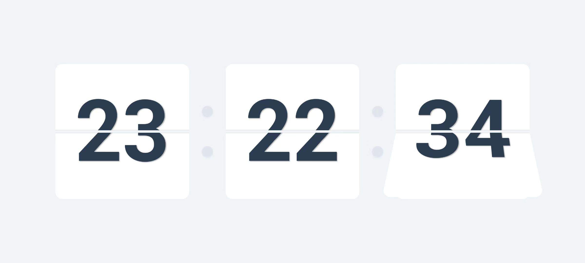
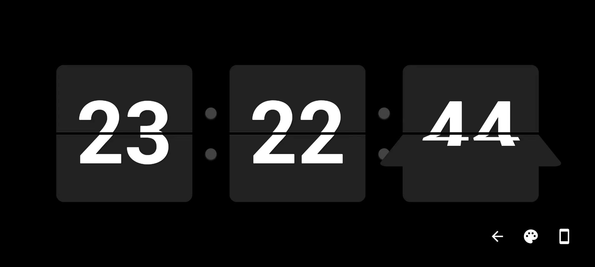
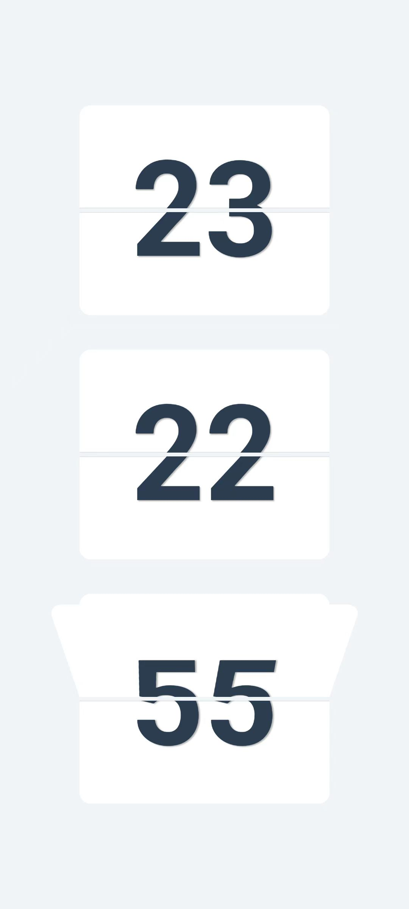

<div align="center">
    <h2>📢 Recommended App</h2>
    <p>This Flip Clock is just one feature of the Snibox all-in-one toolbox.</p>
    <p>Want to experience more useful tools? Download Snibox for a comprehensive productivity boost!</p>
    <div align="center">
    
    <h1 style="border-bottom: none;">Snibox</h1>
   </div>
    <a href="https://apps.apple.com/app/snibox/id">
        
    </a>
</div>

# Flip Clock

FlipClock is a customizable, animated flip clock widget for Flutter applications. It provides a visually appealing way to display the current time with a classic flip animation effect.

### Screenshots

<table>
  <tr><td></td></tr>
  <tr><td></td></tr>
  <tr><td></td></tr>
</table>


## Features

- Elegant flip animation for hours, minutes, and seconds
- Responsive design that adapts to both portrait and landscape orientations
- Customizable themes to match your app's style
- Built with Flutter for cross-platform compatibility

## Getting Started

### Prerequisites

- Flutter (latest stable version)
- Dart SDK

### Installation

1. Ensure that Flutter is installed in your development environment. If not, follow the [Flutter official documentation](https://flutter.dev/docs/get-started/install) for installation.

2. Clone this repository:
   ```
   git clone https://github.com/aidevjoe/Flip-Clock.git
   ```

3. Navigate to the project directory:
   ```
   cd Flip-Clock
   ```

4. Get dependencies:
   ```
   flutter pub get
   ```

5. Run the application:
   ```
   flutter run
   ```

## Usage

To use FlipClock in your Flutter app, simply add the `FlipClockWidget` to your widget tree:

```dart
import 'package:flutter/material.dart';
import 'package:flipclock/flip_clock_widget.dart';
import 'package:flipclock/clock_theme.dart';

class MyHomePage extends StatelessWidget {
  @override
  Widget build(BuildContext context) {
    return Scaffold(
      body: Center(
        child: FlipClockWidget(theme: ClockTheme.themes.last),
      ),
    );
  }
}
```

You can customize the appearance of the clock by creating your own `ClockTheme`:

```dart
final customTheme = ClockTheme(
  backgroundColor: Colors.black,
  secondaryBackgroundColor: Colors.grey[800]!,
  borderColor: Colors.white,
  textColor: Colors.white,
  secondaryTextColor: Colors.white70,
);

FlipClockWidget(theme: customTheme)
```

## Customization

FlipClock offers various customization options through the `ClockTheme` class. You can adjust colors, sizes, and other visual properties to match your app's design.

## Contributing

Contributions are welcome! Please feel free to submit a Pull Request.

## License

This project is licensed under the MIT License - see the [LICENSE](LICENSE) file for details.

## Acknowledgments

- Inspired by classic flip clocks
- Built with Flutter and love

## Support

If you find this project helpful, please give it a star on GitHub and consider supporting its development.